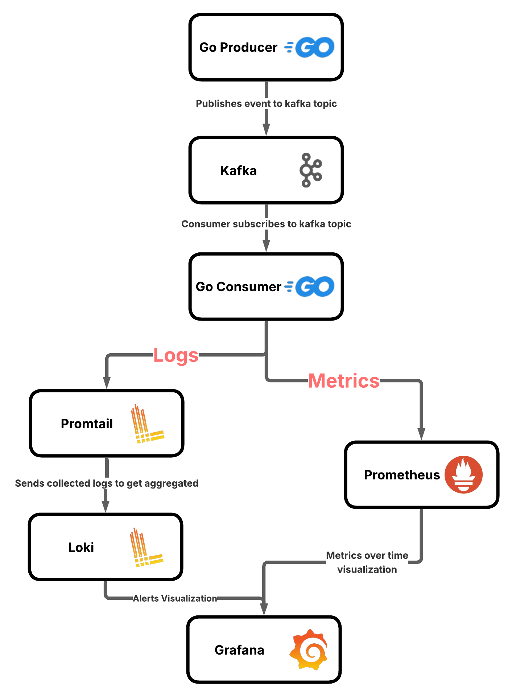
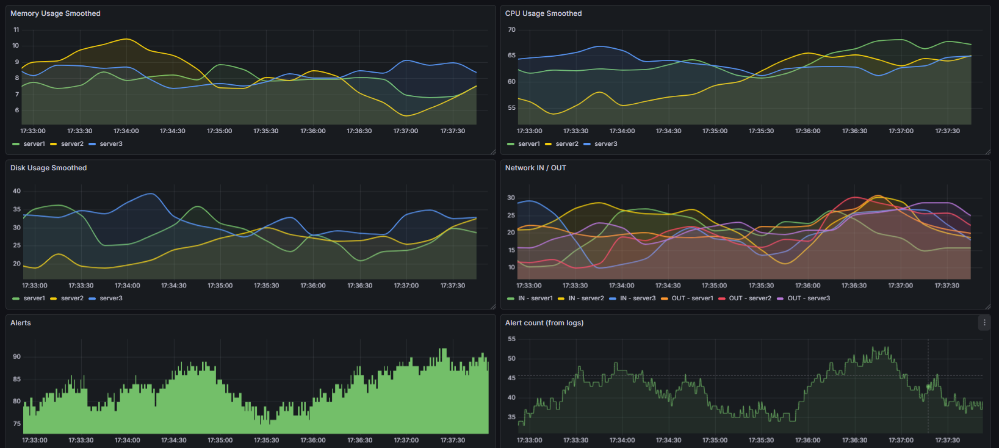

# System Monitoring Project


---

##  Project Overview

This project implements a **distributed monitoring and observability system** using an **event-driven architecture**.

System metrics are **produced, streamed, processed, logged, stored, and visualized in real time**.

### Goals
- Stream system metrics using **Kafka**
- Detect abnormal behavior (**alerts**)
- Store **metrics and logs separately**
- Visualize everything in **Grafana**

### Observability Stack
- **Metrics** → Prometheus  
- **Logs** → Loki  
- **Streaming** → Kafka  
- **Visualization** → Grafana  

---

## 🧱 Tech Stack

| Component | Purpose |
|---------|--------|
| Go | Producer & Consumer applications |
| Kafka | Event streaming platform |
| Zookeeper | Kafka coordination |
| Prometheus | Metrics collection |
| Loki | Log storage |
| Promtail | Log shipping |
| Grafana | Visualization |
| Docker & Docker Compose | Container orchestration |

---

##  End-to-End Flow

<p align="center">
  
</p>

### 1️⃣ Producer (Go)
- Collects / simulates system metrics  
- Publishes events to Kafka topic: system.metrics


### 2️⃣ Kafka
- Stores and streams metric events
- Decouples producer and consumer
- Managed by **Zookeeper**:
- Metadata management
- Leader election
- Broker coordination

### 3️⃣ Consumer (Go)
- Subscribes to `system.metrics`
- Processes incoming events:
- Exposes metrics via `/metrics` (Prometheus)
- Logs alerts to `consumer.log` (Loki)

### 4️⃣ Prometheus
- Scrapes metrics from the consumer
- Stores time-series data:
- CPU usage
- Memory usage
- Disk usage
- Network I/O

### 5️⃣ Promtail
- Tails `consumer.log`
- Ships logs to Loki

### 6️⃣ Loki
- Stores and indexes logs
- Optimized for **event & alert logs**

### 7️⃣ Grafana
- Visualizes:
- **Metrics** (Prometheus)
- **Logs** (Loki)
- Enables correlation between:
- Metric spikes
- Alert logs

---

## 📊 Visualization

<p align="center">
  
</p>

Typical panels include:
- CPU usage over time
- Memory usage
- Disk usage
- Network In / Out
- Alert count
- Log stream for alerts

---

## 🚀 Running the Project

```bash
docker compose build
docker compose up 
```

### 🔌 Services & Ports

| Service     | Address                  |
|------------|---------------------------|
| Kafka       | `localhost:9092`          |
| Grafana     | `http://localhost:3000`   |
| Prometheus  | `http://localhost:9090`   |
| Loki        | `http://localhost:3100`   |

---

### 📡 Grafana Data Sources Setup

#### Prometheus
- **Type:** Prometheus  
- **URL:**  http://prometheus:9090


#### Loki
- **Type:** Loki  
- **URL:**  http://loki:3100


After adding both data sources, **Grafana can correlate metrics and logs within the same dashboards**, enabling efficient observability and debugging.

